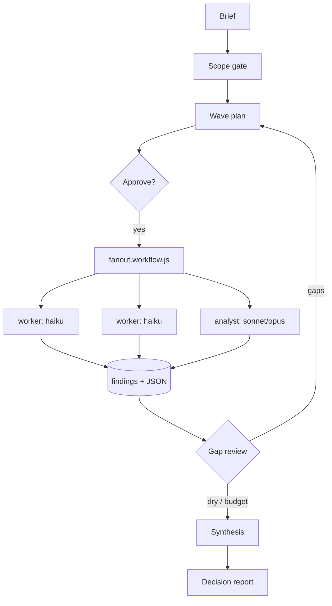

# kai-research

Token-tiered deep-research pipeline for Claude Code: the expensive model plans and judges; capped cheap subagents do the searching.

## What it is

A Claude Code plugin (`/kai-research`) for web research that keeps retrieval out of the expensive model's context. The main thread only plans, reviews gaps, and synthesizes — it never calls WebSearch/WebFetch. Everything else goes to capped subagent tiers, none able to spawn further agents (`disallowedTools: Agent`):

- **`kai-research-worker`** — Haiku retrieval tier, `maxTurns 16`. One narrow question (what exists, what docs say, prior art); ≤4 WebSearch / ≤6 WebFetch; writes a findings file.
- **`kai-research-analyst`** — Sonnet judgment tier (Opus per call for design-shaped sub-questions, ≤2/wave), `maxTurns 24`. Comparison/credibility/tradeoff questions; may read sibling findings; ≤5 WebSearch / ≤8 WebFetch.
- **`kai-research-sweeper`** — Sonnet sweep tier, `maxTurns 200`. Sweep mode only: the same question over a slice of ≤40 items from a known list; ≤4 searches / ≤5 fetches **per item**; appends caller-schema records to numbered chunk files as it goes.

Worker and analyst follow one **findings-file contract**: frontmatter (`question`, `tier`, `model`, `status`, `date`, `sources`) plus fixed sections — TL;DR, Findings (claim, source, date, confidence H/M/L), Contradictions, Sources table, Dead ends; the analyst adds `## Assessment`. The sweeper writes the *caller's* record shape instead — it is domain-agnostic machinery. Replies back to the main thread are schema-capped JSON — raw pages never leave disk.

## Two modes

| The work is | Mode | Product |
|---|---|---|
| A hard problem to decide → N *different* questions | **research** | a decision report with numbered citations |
| A list of ≥15 items → the *same* question per item | **sweep** | one record per item, in the caller's schema, for the caller's ingest |

Sweep mode exists because a research worker capped at 4 searches cannot cover 72 companies, and the caller wants validated JSONL rather than prose. A domain skill owns the record contract — what a fact is, which sources are allowed, what gets refused at ingest — and calls sweep mode for fan-out it does not own. Budgets stay here, domain rules stay there.

Built after a postmortem: one judgment-orchestrated run spawned 102 subagents and burned ~33M tokens. This plugin swaps "pick cheap models by judgment" for code-enforced budgets.

## How it works



Protocol (`SKILL.md`): scope gate → wave plan → approval → fan-out → gap review (next wave, or stop when a wave yields under ~2 new findings) → optional verify wave (Haiku refuters re-check load-bearing claims) → synthesis (problem/criteria, landscape, options table, contradictions, recommendation, design sketch, next probes, sources) → wrap-up with run stats.

The report cites **primary sources by number** — `[1](url)` inline on load-bearing claims, plus a `## Sources` list at the bottom (`[1 - title](url) — pub date — accessed date`), deduplicated by URL across findings files. Findings files are git-ignored working copies, so they are never the citation target; a per-file evidence map stays in the report as an audit trail only.

Fan-out is a deterministic script, not a prompt: `fanout.workflow.js` checks wave size (≤12), tier/model enum, and the Opus quota (≤2) before any agent runs, then dispatches the wave as one parallel batch under a fixed return schema.

Sweep mode (`sweep.md`, `sweep.workflow.js`) follows the same shape with different arithmetic: the caller supplies items, the one question, and the record contract; the script slices the list, refuses anything over ≤40 items/agent or ≤24 agents, refuses Opus outright, and injects the forbidden-domain list into every prompt. Two rules carry the run — sweepers **flush to disk every ≤10 items**, and after each wave a **coverage gate** re-sweeps only the items with no record on disk. Both come from a real 430-item run that hit the session limit mid-flight: the four slices that batched their writes lost everything, the one that flushed kept its work, and re-buying a completed lookup is how a recovery turns into a second full run.

## Why tiers-as-config

Model tier is configuration, not persuasion — pinned in each agent's frontmatter and the per-call `model` argument, never by prompt instructions to an orchestrator (a verified no-op).

| Role | Model | USD/MTok in / out* |
|---|---|---|
| Main thread | session model | 10 / 50 |
| worker | haiku | 1 / 5 |
| analyst | sonnet | 3 / 15 |
| analyst (opus calls) | opus | 5 / 25 |

*Snapshot rates (2026-07), illustrative, not live pricing.

Research is retrieval-heavy — most tokens go to searches and fetches, not judgment. Routing that bulk through a tier 3–10× cheaper per token, handed off as files rather than conversation, is where the savings compound.

## Install

The repo is its own plugin marketplace:

```
git clone <repo-url> kai-research
claude plugin marketplace add ./kai-research
claude plugin install kai-research@kai-research
```

(Once the repo is on GitHub, `claude plugin marketplace add <owner>/kai-research` works directly.)

Install at **user** scope — the pipeline is meant to run from any repo. Leave `CLAUDE_CODE_SUBAGENT_MODEL` unset: it overrides every model pin here.

## Usage

```
/kai-research <a decision to inform, with known constraints>
```

Not for single-fact lookups (answer those directly) and not a general orchestrator. If the brief is underspecified, the skill asks up to 3 scoping questions first; otherwise it proposes a wave plan (questions, tiers/models, agent count, cost estimate) and waits for approval — unless you pre-authorize a budget envelope. Each wave writes findings to `<outdir>/<wave><NN>-<slug>.md` and returns a tiny JSON summary; the main thread then plans another wave or synthesizes. Output: a decision report plus printed run stats (waves, agents per tier, findings count, estimated cost).

## Configuration & limits

Research mode:

- Wave size: ≤8 by convention, **hard cap 12** (script-enforced).
- Run budget: `max_agents` default **16**.
- Opus sub-questions: **≤2 per wave** — checked in the protocol and the script.
- Worker: ≤4 WebSearch / ≤6 WebFetch, `maxTurns 16`; tools = WebSearch + WebFetch + Write.
- Analyst: ≤5 WebSearch / ≤8 WebFetch, `maxTurns 24`; adds Read/Grep/Glob.
- Return JSON: `tldr` ≤1000 chars, ≤5 contradictions, ≤3 hooks — schema-enforced.

Sweep mode:

- Items per agent: default **25**, hard cap **40** (79/agent was observed to burn 200–320k tokens).
- Run budget: `max_agents` default **12**, hard cap **24** — over that, split into waves.
- Models: `haiku | sonnet` only; Opus sweeps are refused by the script.
- Flush: every **5** items by default, hard cap 10 — chunk files are numbered and never rewritten.
- Return JSON: counts, chunk paths, ≤5 flagged items, ≤3 hooks. No prose.

Both:

- No harness knob caps search/fetch counts directly; prompt budgets + `maxTurns` back them.
- Never delegate to `general-purpose` — its tools are `*`, so it inherits Agent and fans out again underneath you.
- Recommended: set `CLAUDE_CODE_MAX_SUBAGENTS_PER_SESSION` in your user settings as a session-wide circuit breaker. It counts agents, not tokens — treat it as a backstop, not a budget.

## Status

`0.2.0` (`plugin.json`). Early-stage, single author. Born from one very expensive postmortem, validated on real research runs since; agent prompts, workflow schema, and findings format may still change. Sweep mode is new in 0.2.0 and its defaults are calibrated on one 430-item run, not yet on many.

## License

MIT — see [LICENSE](LICENSE).
